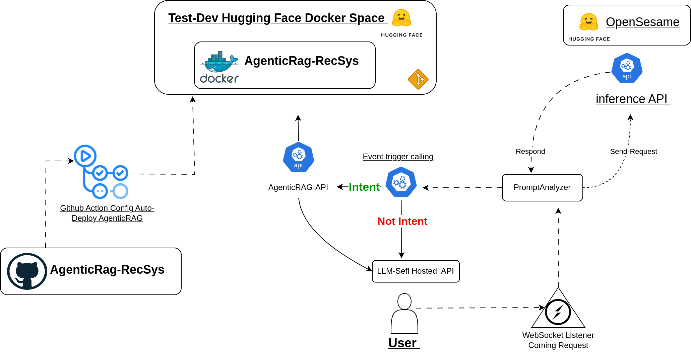

markdown
# Advllm SDK RecSys AgenticRag Multi-Agent Workflow GraphRAG

Advllm is a Python SDK for building recommendation systems for advertising based on language models. This SDK provides tools for interacting with various models and services.

<div align="center">
    </br>
    <figcaption>OpenTheVault-API</figcaption>
</div>

here's a high-level explanation and the plan to implement the FastAPI WebSocket server that listens to incoming requests, processes them through the self-hosted LLM, and interacts with other components as needed.
System Design Workflow :

* User Interaction:
    A user sends a request, which needs to be processed by the system.
* WebSocket Listener:
    This component listens for incoming requests using WebSocket. The FastAPI WebSocket server will handle this part.
    Once a message is received, it sends the request to the PromptAnalyzer.
* PromptAnalyzer:
    Analyzes the incoming prompt to determine whether it contains an intent that should be handled by AgenticRAG-API or directly by the LLM-Self Hosted API.
* Intent Classification:
    If the intent is identified, the request is forwarded to the AgenticRAG-API.
    If no intent is identified, the request is sent to the LLM-Self Hosted API.
* LLM-Self Hosted API:
    Processes the request and sends back the response.
* OpenTheVault-API:
    Handles specific intents and interacts with other systems or APIs as required.
* Response Handling:
    The response is sent back through the WebSocket to the user.

#### Setup the Workflow

1. Push Fine-Tuned OpenSesame on Hugging Face and Get the API Inference Endpoint

Fine-tune your model using OpenSesame and push it to Hugging Face. Once deployed, you will receive an API inference endpoint to interact with your model.

```bash

# Example command to push model to Hugging Face (details may vary)
huggingface-cli login
huggingface-cli repo create your-model-name
git add .
git commit -m "Initial commit"
git push
```

After pushing the model, note down the API inference endpoint provided by Hugging Face.

2. Host OpenTheVault Multi-Agent Workflow Based on LLM on Docker

Deploy the OpenTheVault multi-agent workflow using Docker. Make sure your Docker environment is set up and the required Docker images are available.

3. Download and install the advllm SDK to leverage built-in functionalities for your project

**Notation** the models alreasy in folder **notebook** 

## Getting Started

To get started with Advllm, follow the steps below:

1. Install the SDK:

```bash
pip install advllm
```

### Features Tested with unietesting

- [x] Different LLM calling APIs OpenAI compatibility based-models in different versions such as Ollama (Llama, Alpaca, Vicuna, Llama 2 )  Mixtral , GPTs Sefl-Hosted LLM 
- [ ] Query Listening Stream Request AgenticRAG
- [x] Hugging Face Model Self-Hosted Inference APis calling 
- [x] Inference API Requetes OpenSesame Compute Intent-Score 
- [x] Configure Self-Hosted APIs Text-Generation (ollama)
- [x] OpenAI-like interface using [llm-api-python](https://ollama.com/blog/openai-compatibility)
- [ ] handling Exceptions Requests Status Erros Faild Network Semd Data TCP 


### Compute Intention user buying 

Create a configuration file named config.json to access the PiGrieco/OpenSesame fine-tuned version, which computes the score of intention to buy based on user prompts. Obtain the API token by requesting access via email:

```json

{
    "model_id": "PiGrieco/OpenSesame",
    "api_token": "hf_XXXXXXXX"
}
```

1. Initialize the OpenSesameAPI class with the configuration and send queries to the OpenSeamo model:

```python

from advllm.openseamo import OpenSeamoAPI
from advllm.config import ConfigHF

# Option 1: Directly hardcode parameters in Config
# model_id = "PiGrieco/OpenSesame"
# api_token = "hf_XXXXXXXX"
# config = ConfigHF(model_id, api_token)

# Option 2: Load parameters from JSON file
config = ConfigHF.from_json("config.json")

openseamo_model = OpenSeamoAPI(config)

prompt = "I am interested in purchasing an iPhone 12 around $700, red, 64GB, Germanyo "
result = openseamo_model.query(prompt)
print("Model response:", result)

```

### Self-Hosted LLM Private Model 

Create a PromptFactory instance with customized prompt messages:

#####  CURL Example of any Host LLM 


```YAML

curl --location "https://api.mistral.ai/v1/chat/completions" \
     --header 'Content-Type: application/json' \
     --header 'Accept: application/json' \
     --header "Authorization: Bearer $MISTRAL_API_KEY" \
     --data '{
    "model": "mistral-large-latest",
    "messages": [
     {
        "role": "user",
        "content": "What is the best French cheese?"
      }
    ]
  }'


```
**usage**

```python
import requests
from advllm.config import ConfigLLM
from advllm.self_hosted_llm_requester import SelfHostedLLMRequester
from advllm.prompt_factory import PromptFactory

base_url = 'https://api.mistral.ai/v1/chat/completions'
headers = {
    'Content-Type': 'application/json',
    'Accept': 'application/json',
    'Authorization': f'Bearer {MISTRAL_API_KEY}'  # Make sure to replace MISTRAL_API_KEY with your actual API key
}
model_name = 'mistral-large-latest'
question_content = "What is the best French cheese?"
factory = PromptFactory(question=question_content)
prompt_messages = factory.generate_prompt()
config = ConfigLLM(base_url=base_url, headers=headers, prompt=prompt_messages)
requester = SelfHostedLLMRequester(config)
payload = config,Prompt(model_name=model_name)
response = requester.send_request(payload)
print(response)
```

### PromptAnalyzer 

The `PromptAnalyzer` class allows you to analyze prompts, extract keywords, and determine the intent of the prompt using a pre-trained zero-shot model.


**Set the config Depends on Optiona**
```json

{
    "model_id": "PiGrieco/OpenSesame",
    "api_token": "hf_XXXXXXXX"
}
```

```python 
from advllm.prompt_analyzer import PromptAnalyzer
from advllm.clients.inference_client import ConfigHF


prompt = "searching at amazon to check what is the most relevant product"

config = ConfigHF.from_json("config.json")

prompt_analyzer = PromptAnalyzer(config, keywords_extracted=True)
is_match, keywords, intent_score, orignal_prompt  = prompt_analyzer.analyze_prompt(prompt)

print("Prompt Analysis Result:")
print(f"Is intent to buy: {is_match}")
print(f"Keywords: {keywords}")
print(f"Intent Score: {intent_score:.2f}")
print(f"Orignal Prompt: {orignal_prompt}") 
```

#### OpenTheVault Request APi

The OpenTheVault class is designed to interact with an external API endpoint. Below is a step-by-step guide on how to use this class to send requests and handle responses.

```python 
from advllm.models.OpenTheVault import OpenTheVault

# Replace these values with your actual API endpoint and API key if available
api_endpoint = "http://your-api-endpoint.com"
api_key = "YOUR_API_KEY" 

# Example prompt and intent score
prompt = "What is the weather like today?"
intent_score = 0.95
status = True

# Initialize the OpenTheVault class
open_the_vault = OpenTheVault(api=api_endpoint, Prompt=prompt, intent_Score=intent_score, Statu=status)

response = open_the_vault.send_request()

if "error" in response:
    print("Error:", response["error"])
else:
    print("Response:", response)
```


### Building WordOfPrompt with OpenSesame and OpenTheVault

This guide will help you build an end-to-end workflow integration using FastAPI WebSocket to listen to user prompts and pass them to our services.
1. Listen to the Prompt from Self-Hosted LLM

First, let's explain how to listen to a user's message and pass it into our services.
Example: Using cURL with Self-Hosted LLM (OpenAI Compatibility)

Here is an example of using cURL to send a request to a self-hosted LLM:

```sh

curl http://localhost:11434/v1/chat/completions \
    -H "Content-Type: application/json" \
    -d '{
        "model": "llama2",
        "messages": [
            {
                "role": "system",
                "content": "You are a helpful assistant."
            },
            {
                "role": "user",
                "content": "Hello!"
            }
        ]
    }'

```

2. Setting Up the Listener with FastAPI WebSocket

To build an end-to-end workflow integration, set up a listener using FastAPI WebSocket. This will allow you to receive messages from users in real-time and process them accordingly. Below is the complete integration with detailed comments.


```python 
import json
import logging
from fastapi import FastAPI, WebSocket, HTTPException
from advllm.client.self_hosted_llm_requester import (
    SelfHostedLLMRequester,
    WebSocketConnectionManager,
    Message
)
from advllm.prompt_analyzer import PromptAnalyzer
from advllm.clients.inference_client import ConfigHF
from advllm.models.OpenTheVault import OpenTheVault

app = FastAPI()

# Logger configuration
logging.basicConfig(level=logging.INFO)
logger = logging.getLogger("websocket")

# Initialize WebSocket connection manager
manager = WebSocketConnectionManager()

# Initialize the LLM requester for the self-hosted model
llm_requester = SelfHostedLLMRequester(
    base_url="http://localhost:11434",
    headers={
        'Content-Type': 'application/json',
        'Accept': 'application/json',
    },
    model="llama2"
)

# Load configuration for the PromptAnalyzer from a JSON file
config = ConfigHF.from_json("config.json")

## EndPoitn Server  OpenTheVault
api_endpoint = "http://your-api-endpoint.com"
api_key = "YOUR_API_KEY"

@app.websocket("/ws/AgenticRAG-API")
async def websocket_endpoint(websocket: WebSocket):
    await manager.connect(websocket)
    try:
        while True:
            # Receive message from the WebSocket
            data = await websocket.receive_text()
            message_dict = json.loads(data)
            message_content = message_dict.get("content", "")
            logger.info(f"Received message: {message_content}")

            # Initialize the PromptAnalyzer with the configuration and keywords extraction enabled
            prompt_analyzer = PromptAnalyzer(config, keywords_extracted=True)

            # Analyze the prompt to determine if it contains intent and extract additional information
            contains_intent, keywords, intent_score, original_prompt = prompt_analyzer.analyze_prompt(message_content)

            if contains_intent:
                # Handle the message with the AgenticRAG-API if intent is detected
                open_the_vault = OpenTheVault(api=api_endpoint, Prompt=prompt, intent_Score=intent_score, Statu=status)
                response = open_the_vault.send_request()
                if "error" in response:
                    raise HTTPException(status_code=500, detail=response["error"])
            else:
                # Send the message to the self-hosted LLM and get the response if no intent is detected
                response = llm_requester.send_request(message_content)

            # Convert the response to a JSON string and send it back to the WebSocket client
            response_str = json.dumps(response)
            await manager.send_personal_message(response_str, websocket)
    except WebSocketDisconnect:
        # Handle WebSocket disconnection
        manager.disconnect(websocket)
        logger.info("WebSocket disconnected")

@app.get("/")
async def read_root():
    return {"message": "Welcome to the FastAPI WebSocket and AgenticRag integration "}

```


